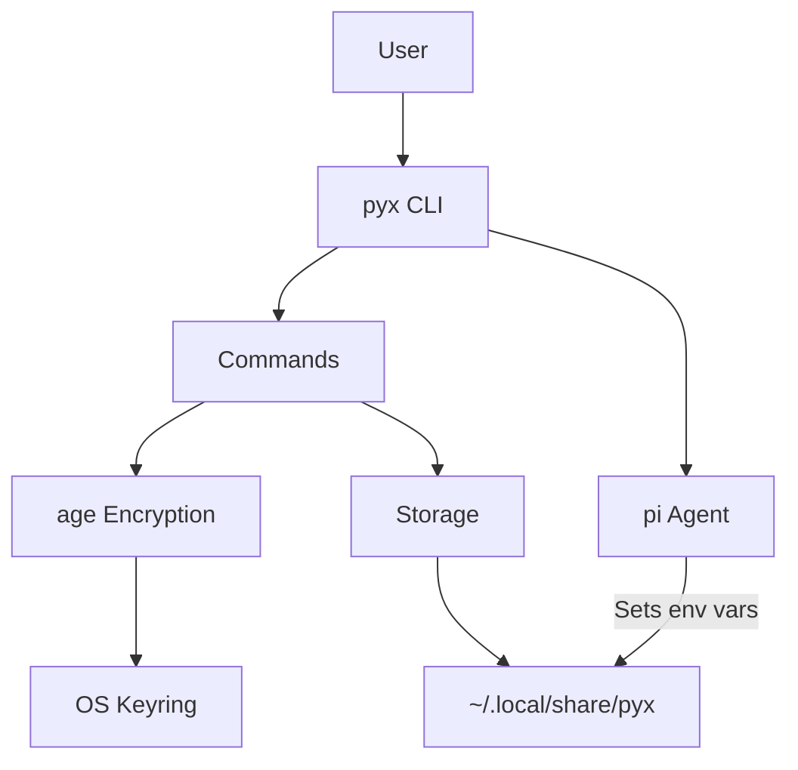

# pyx

```text
██████  ██
██  ██  ██    Secure CLI tool for managing AI provider API keys 
████  ██  ██  with age encryption and pi coding agent integration.
██    ██  ██
```

[](https://www.rust-lang.org/)
[](https://opensource.org/licenses/MIT)
[](https://github.com/dkmnx/pyx/actions/workflows/ci.yml)
[](https://github.com/dkmnx/pyx/releases/latest)

## Overview

Pyx provides secure storage and management of API keys for AI providers. It encrypts credentials using age encryption and integrates with pi by setting the appropriate environment variables.

## Quick Start

### Install macOS/Linux

```bash
curl -fsSL https://raw.githubusercontent.com/dkmnx/pyx/main/install.sh | sh
```

### Install Windows (PowerShell)

```bash
irm https://raw.githubusercontent.com/dkmnx/pyx/main/install.ps1 | iex
```

### Build from source

```bash
git clone https://github.com/dkmnx/pyx.git
cd pyx
just install
```

### Setup

```bash
pyx init
pyx add

# Run pi with all configured providers
pyx
```

## Features

- **Secure Storage** - Age encryption (ChaCha20-Poly1305) for all API keys
- **Multiple Providers** - Support for Anthropic, OpenAI, Google, Groq, and 50+ more
- **Multi-Provider** - Run pi with all configured providers simultaneously
- **Shell Completion** - Full bash, zsh, fish, and PowerShell support
- **Keyring Integration** - OS keyring storage for master passphrase

## Commands

| Command                  | Description                        |
| ------------------------ | ---------------------------------- |
| `pyx init`               | Initialize encrypted store         |
| `pyx add`                | Add a provider credential          |
| `pyx list`               | List configured providers          |
| `pyx delete <provider>`  | Delete a provider                  |
| `pyx models`             | List supported AI models           |
| `pyx pi install`         | Install pi coding agent            |
| `pyx`                    | Run pi with all providers          |
| `pyx <provider>`         | Run pi with specific provider      |
| `pyx completion [shell]` | Generate shell completions         |

## Architecture



## Documentation

| Category         | Document                                          | Description            |
| ---------------- | ------------------------------------------------- | ---------------------- |
| **Guides**       | [Getting Started](docs/guides/getting-started.md) | Installation and setup |
|                  | [Usage](docs/guides/usage.md)                     | Command reference      |
|                  | [Troubleshooting](docs/guides/troubleshooting.md) | Common issues          |
| **Reference**    | [Architecture](docs/reference/architecture.md)    | System design          |
|                  | [Security](docs/reference/security.md)            | Encryption model       |
|                  | [Storage](docs/reference/storage.md)              | Data files             |
|                  | [Providers](docs/reference/providers.md)          | Provider configuration |
| **Contributing** | [Contributing](docs/contributing.md)              | Development guide      |

## Development

```bash
# Build
just build-prod

# Test
just test

# Format & lint
just fmt
just lint

# All checks before commit
just check
```

## License

[MIT](LICENSE)
