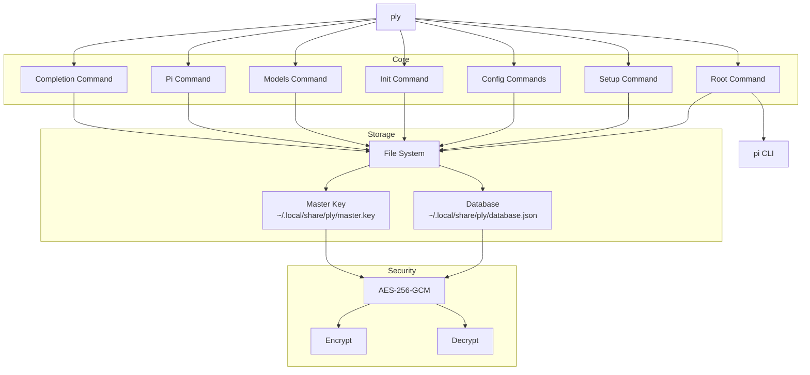
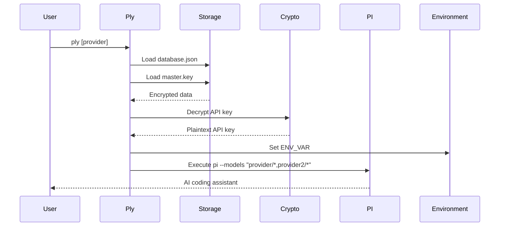
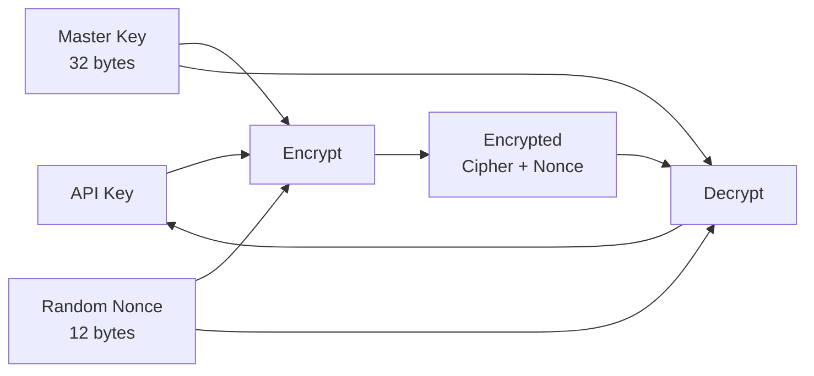

# Architecture

Overview of ply's design, security model, and component interactions.

## System Architecture

## Data Flow

## Security Model

### Encryption

Ply uses AES-256-GCM for encrypting API keys:

- **Key Size**: 256 bits (32 bytes)
- **Mode**: Galois/Counter Mode (GCM)
- **Nonce Size**: 96 bits (12 bytes)

### File Permissions

| File | Permission | Description |
|------|------------|-------------|
| `master.key` | 0600 | Read/write only for owner |
| `database.json` | 0600 | Read/write only for owner |

## Components

### internal/cmd

CLI command implementations using Cobra.

| File | Purpose |
|------|---------|
| `root.go` | Root command, provider selection, pi execution |
| `setup.go` | Initialize configuration, add providers |
| `init.go` | Initialize master encryption key |
| `reset.go` | Reset all configuration and data |
| `config.go` | Parent command for config subcommands |
| `config_list.go` | List configured providers |
| `config_edit.go` | Edit provider configuration |
| `config_delete.go` | Delete provider |
| `models.go` | List supported AI models |
| `pi.go` | Manage pi installation |
| `completion.go` | Shell completion scripts |
| `version.go` | Version information |

### internal/crypto

Encryption utilities.

| Function | Purpose |
|----------|---------|
| `Encrypt()` | Encrypt plaintext with AES-256-GCM |
| `Decrypt()` | Decrypt ciphertext with AES-256-GCM |
| `GenerateKey()` | Generate random 32-byte key |

### internal/database

Encrypted credential storage.

| Type/Method | Purpose |
|------------|---------|
| `Entry` | Provider credential struct |
| `Database` | Manages encrypted storage |
| `Load()` | Load entries from disk |
| `Save()` | Persist entries to disk |
| `AddEntry()` | Add new provider |
| `GetEntry()` | Retrieve by ID |
| `ListEntries()` | List all entries |
| `DeleteEntry()` | Delete entry by ID |
| `UpdateEntry()` | Update existing entry |

### internal/fs

File system utilities.

| Function | Purpose |
|----------|---------|
| `DataDir()` | Get ply data directory |
| `EnsureDataDir()` | Create data directory if missing |
| `LoadMasterKey()` | Load encryption key |
| `SaveMasterKey()` | Save encryption key |
| `MasterKeyExists()` | Check if master key exists |
| `MasterKeyPath()` | Get master key file path |
| `DataDirExists()` | Check if data directory exists |

## Environment Integration

Ply sets environment variables before executing pi:

```mermaid
graph LR
    Provider[Provider Selection] --> ENV[Environment Variable]
    ENV --> PI[pi CLI]

    subgraph Provider Mapping
        anthropic --> ANTHROPIC_API_KEY
        openai --> OPENAI_API_KEY
        google --> GEMINI_API_KEY
        groq --> GROQ_API_KEY
        azure-openai-responses --> AZURE_OPENAI_API_KEY
        xai --> XAI_API_KEY
        openrouter --> OPENROUTER_API_KEY
        vercel-ai-gateway --> AI_GATEWAY_API_KEY
        zai --> ZAI_API_KEY
        mistral --> MISTRAL_API_KEY
        minimax --> MINIMAX_API_KEY
        huggingface --> HF_TOKEN
        opencode --> OPENCODE_API_KEY
        kimi-coding --> KIMI_API_KEY
        cerebras --> CEREBRAS_API_KEY
        amazon-bedrock --> AWS_BEARER_TOKEN_BEDROCK
        github-copilot --> GITHUB_TOKEN
        google-vertex --> GOOGLE_APPLICATION_CREDENTIALS
        openai-codex --> OPENAI_API_KEY
        minimax-cn --> MINIMAX_CN_API_KEY
    end
```

## Provider Support

| Provider | Env Var | Models Prefix |
|----------|---------|---------------|
| Anthropic | `ANTHROPIC_API_KEY` | `anthropic/*` |
| OpenAI | `OPENAI_API_KEY` | `openai/*` |
| Google Gemini | `GEMINI_API_KEY` | `google/*` |
| Groq | `GROQ_API_KEY` | `groq/*` |
| Azure OpenAI | `AZURE_OPENAI_API_KEY` | `azure-openai-responses/*` |
| xAI | `XAI_API_KEY` | `xai/*` |
| OpenRouter | `OPENROUTER_API_KEY` | `openrouter/*` |
| Vercel AI Gateway | `AI_GATEWAY_API_KEY` | `vercel-ai-gateway/*` |
| ZAI | `ZAI_API_KEY` | `zai/*` |
| Mistral | `MISTRAL_API_KEY` | `mistral/*` |
| MiniMax | `MINIMAX_API_KEY` | `minimax/*` |
| Hugging Face | `HF_TOKEN` | `huggingface/*` |
| OpenCode | `OPENCODE_API_KEY` | `opencode/*` |
| Kimi | `KIMI_API_KEY` | `kimi-coding/*` |
| Cerebras | `CEREBRAS_API_KEY` | `cerebras/*` |
| Amazon Bedrock | `AWS_BEARER_TOKEN_BEDROCK` | `amazon-bedrock/*` |
| GitHub Copilot | `GITHUB_TOKEN` | `github-copilot/*` |
| Google Vertex | `GOOGLE_APPLICATION_CREDENTIALS` | `google-vertex/*` |
| OpenAI Codex | `OPENAI_API_KEY` | `openai-codex/*` |
| MiniMax CN | `MINIMAX_CN_API_KEY` | `minimax-cn/*` |
