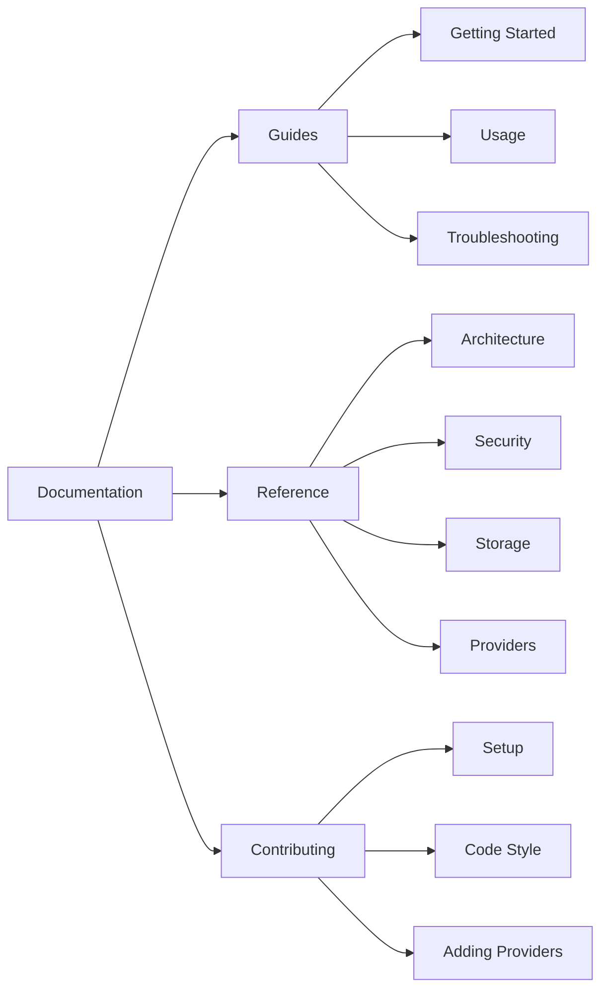

# Documentation

Comprehensive documentation for the pyx CLI tool.

## Quick Navigation

| Category         | Documents                                    | Description                           |
| ---------------- | -------------------------------------------- | ------------------------------------- |
| **Guides**       | [Getting Started](guides/getting-started.md) | Installation and initial setup        |
|                  | [Usage](guides/usage.md)                     | Complete command reference            |
|                  | [Troubleshooting](guides/troubleshooting.md) | Common issues and solutions           |
| **Reference**    | [Architecture](reference/architecture.md)    | System design and component overview  |
|                  | [Security](reference/security.md)            | Encryption model and best practices   |
|                  | [Storage](reference/storage.md)              | Data files, formats, and permissions  |
|                  | [Providers](reference/providers.md)          | Supported providers and configuration |
| **Contributing** | [Contributing](contributing.md)              | Development guidelines and PR process |

## Quick Start

```bash
# Install
curl -L -o pyx.tar.gz "<release-url>" && tar -xzf pyx.tar.gz && sudo mv pyx /usr/local/bin/

# Or build from source
git clone https://github.com/dkmnx/pyx.git && cd pyx && just install

# Setup
pyx setup

# Run with all configured providers
pyx
```

## Documentation Map



## Related

- [README](../README.md) - Project overview
- [CHANGELOG](../CHANGELOG.md) - Version history
