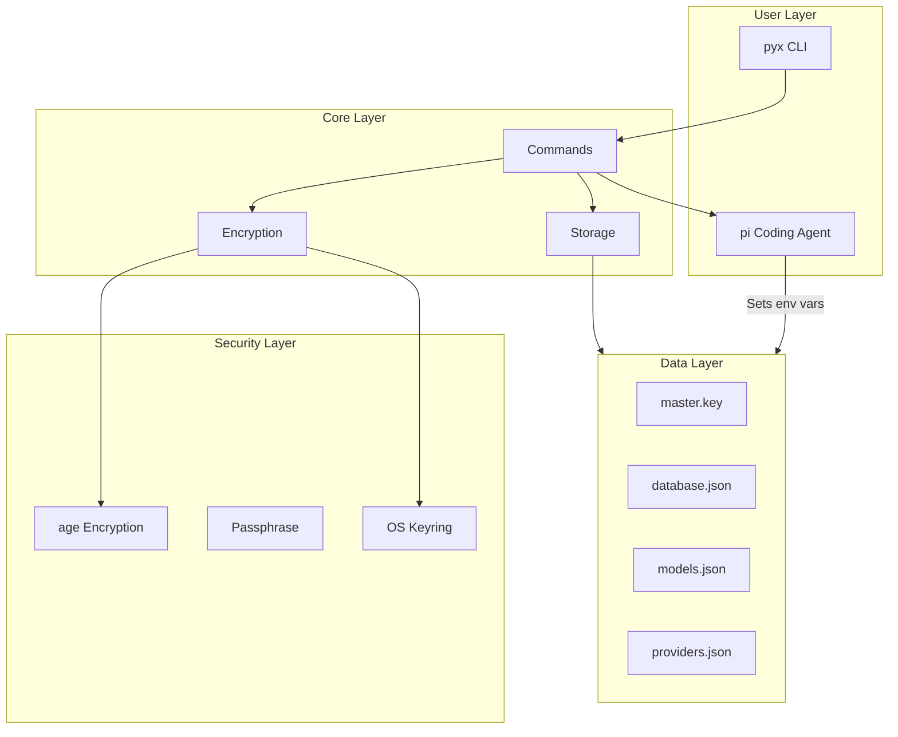
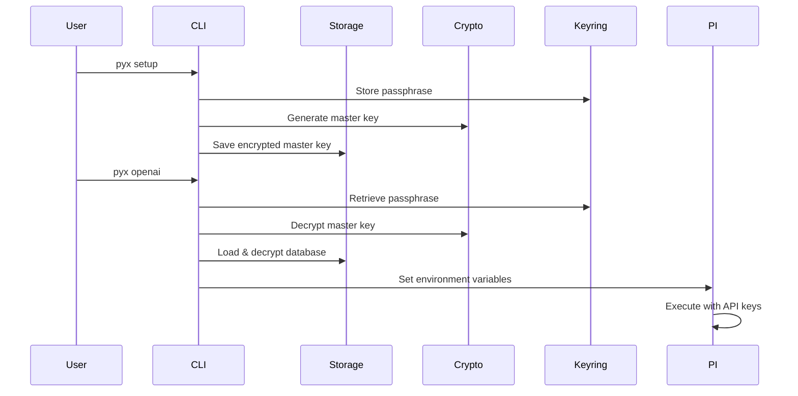

# Architecture

System design, component overview, and security model for pyx.

## Overview

Pyx is a Rust CLI tool that securely manages AI provider API keys using age encryption. It integrates with the pi coding agent by setting appropriate environment variables.

## Architecture Diagram



## Component Structure

```text
src/
├── main.rs              # CLI entry point
├── lib.rs               # Library exports
├── cli.rs               # Command definitions
├── commands/            # Command implementations
│   ├── mod.rs
│   ├── setup.rs         # Initialize & configure
│   ├── list.rs          # List providers
│   ├── delete.rs        # Delete provider
│   ├── models.rs        # Model listing
│   ├── pi.rs            # Pi management
│   ├── reset.rs         # Reset configuration
│   ├── completion.rs    # Shell completions
│   ├── version.rs       # Version info
│   └── root.rs          # Root command
├── storage/             # Data persistence
│   ├── mod.rs
│   ├── database.rs      # Encrypted credentials
│   ├── paths.rs         # Path management
│   ├── settings.rs      # User settings
│   ├── providers_env.rs # Provider env vars
│   ├── models_cache.rs  # Model cache
│   └── atomic_write.rs  # Safe writes
├── keys/                # Master key management
│   ├── mod.rs
│   ├── manager.rs       # Key lifecycle
│   └── keyring/         # Passphrase storage
│       ├── mod.rs       # Backend abstraction
│       ├── backend.rs   # KeyringBackend trait
│       ├── file_fallback.rs
│       ├── linux.rs
│       ├── macos.rs
│       ├── windows.rs
│       └── tests.rs
├── crypto/              # Age encryption
│   └── mod.rs
├── providers/           # Provider handling
│   ├── mod.rs
│   ├── mapping.rs       # Provider->env mapping
│   └── validation.rs    # Provider name/env var validation
├── models/              # Model fetching
│   ├── mod.rs
│   ├── fetch.rs         # Remote fetch
│   └── parse.rs         # Response parsing
├── pi/                  # Pi integration
│   └── mod.rs
└── passphrase.rs        # Interactive prompts
```

## Data Flow



## Security Architecture

See [Security](security.md) for detailed encryption model.

## Provider Resolution

See [Providers](providers.md) for resolution order.

## Storage

See [Storage](storage.md) for data file details.
