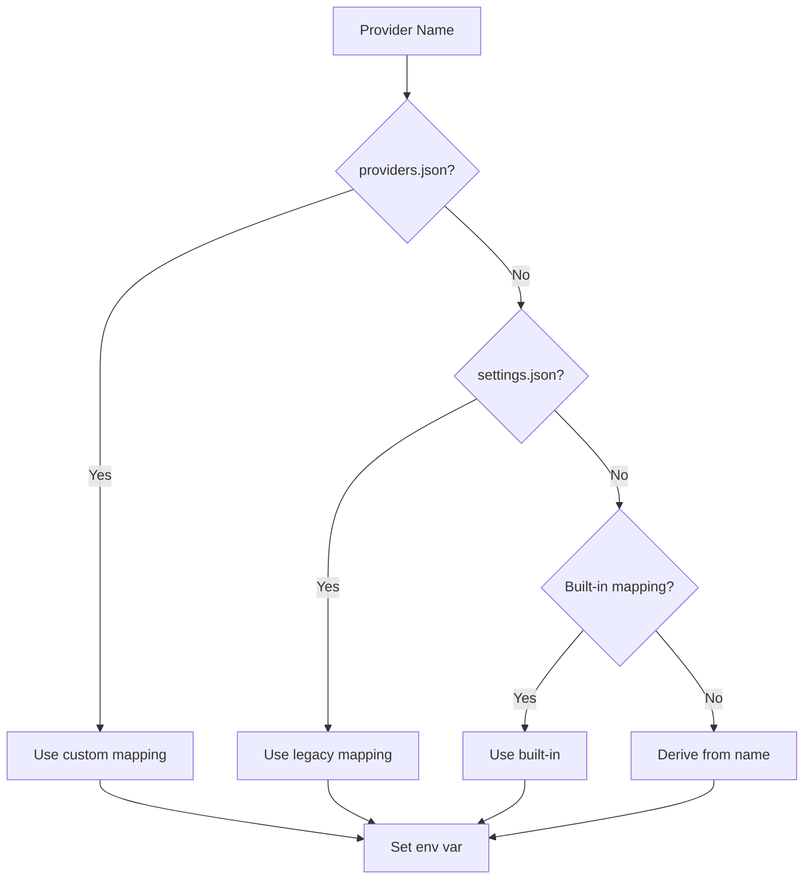

# Providers

Supported AI providers and environment variable configuration.

## Provider Resolution

When pyx sets environment variables for pi, it resolves provider names to environment variables in this order:



## Resolution Order

1. **Custom mappings** - `~/.local/share/pyx/providers.json`
2. **Legacy settings** - `settings.json`
3. **Built-in mappings** - 50+ providers
4. **Name derivation** - `provider` → `PROVIDER_API_KEY`

## Built-in Providers

Pyx includes explicit environment variable mappings for the following providers:

| Provider                 | Environment Variable             |
| ------------------------ | -------------------------------- |
| `amazon-bedrock`         | `AWS_BEARER_TOKEN_BEDROCK`       |
| `anthropic`              | `ANTHROPIC_API_KEY`              |
| `azure-openai-responses` | `AZURE_OPENAI_API_KEY`           |
| `cerebras`               | `CEREBRAS_API_KEY`               |
| `deepseek`               | `DEEPSEEK_API_KEY`               |
| `github-copilot`         | `GITHUB_TOKEN`                   |
| `google`                 | `GEMINI_API_KEY`                 |
| `google-antigravity`     | `GEMINI_API_KEY`                 |
| `google-gemini-cli`      | `GEMINI_API_KEY`                 |
| `google-vertex`          | `GOOGLE_APPLICATION_CREDENTIALS` |
| `groq`                   | `GROQ_API_KEY`                   |
| `huggingface`            | `HF_TOKEN`                       |
| `kimi-coding`            | `KIMI_API_KEY`                   |
| `minimax`                | `MINIMAX_API_KEY`                |
| `minimax-cn`             | `MINIMAX_CN_API_KEY`             |
| `mistral`                | `MISTRAL_API_KEY`                |
| `openai`                 | `OPENAI_API_KEY`                 |
| `openai-codex`           | `OPENAI_API_KEY`                 |
| `opencode`               | `OPENCODE_API_KEY`               |
| `opencode-go`            | `OPENCODE_API_KEY`               |
| `openrouter`             | `OPENROUTER_API_KEY`             |
| `qwen`                   | `QWEN_API_KEY`                   |
| `vercel-ai-gateway`      | `AI_GATEWAY_API_KEY`             |
| `xai`                    | `XAI_API_KEY`                    |
| `zai`                    | `ZAI_API_KEY`                    |

**Note:** For providers not listed above, pyx automatically derives the environment variable name by converting the provider name to uppercase and replacing hyphens with underscores, then appending `_API_KEY`. For example, `my-provider` → `MY_PROVIDER_API_KEY`.

Custom mappings in `providers.json` take precedence over built-in mappings.

### Provider Name Validation

Provider names must match the regex `^[a-zA-Z0-9_-]{1,50}$` (alphanumeric, hyphens, underscores, 1-50 characters).

Environment variable names in custom mappings must match `^[A-Z_][A-Z0-9_]*$` (uppercase letters, digits, underscores, starting with letter or underscore).

## Custom Providers

### Adding Custom Mappings

Create or edit `~/.local/share/pyx/providers.json`:

```json
{
  "my-provider": "MY_CUSTOM_API_KEY"
}
```

**Note:** Make sure you have a corresponding pi extension installed for your custom provider. pyx only sets environment variables; the pi extension must support the provider name.

### Using Custom Providers

```bash
pyx my-provider  # Sets MY_CUSTOM_API_KEY env var
```

## Environment Variables

### Provider API Keys

| Provider               | Variable               | Required   |
| ---------------------- | ---------------------- | ---------- |
| Anthropic              | `ANTHROPIC_API_KEY`    | Yes        |
| OpenAI                 | `OPENAI_API_KEY`       | Yes        |
| Google                 | `GEMINI_API_KEY`       | Yes        |
| Groq                   | `GROQ_API_KEY`         | Yes        |
| Mistral                | `MISTRAL_API_KEY`      | Yes        |
| Azure OpenAI Responses | `AZURE_OPENAI_API_KEY` | Yes        |

**Note:** Provider names are case-sensitive and use hyphens (e.g., `azure-openai-responses`). See [Built-in Providers](#built-in-providers) for complete list.

### Pyx Configuration

| Variable                 | Description       | Default   |
| ------------------------ | ----------------- | --------- |
| `PYX_PASSPHRASE`         | Master passphrase | Keyring   |
| `PYX_SCRYPT_WORK_FACTOR` | KDF iterations    | 18        |
| `PYX_SCRYPT_SALT_LEN`    | Salt length       | 16        |

## Verification

```bash
# List configured providers
pyx list

# Show environment variables (dry run)
pyx list --json
```
