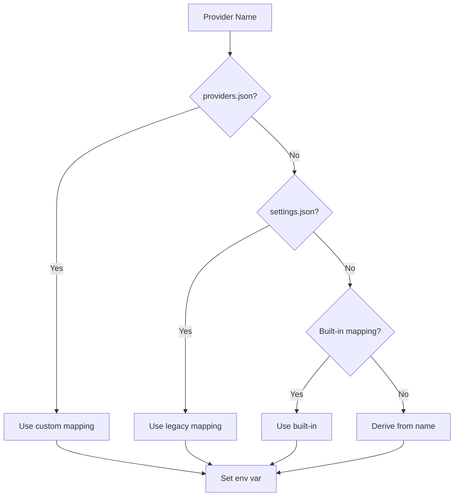

# Providers

Supported AI providers and environment variable configuration.

## Provider Resolution

When pyx sets environment variables for pi, it resolves provider names to environment variables in this order:



## Resolution Order

1. **Custom mappings** - `~/.local/share/pyx/providers.json`
2. **Legacy settings** - `settings.json`
3. **Built-in mappings** - 50+ providers
4. **Name derivation** - `provider` → `PROVIDER_API_KEY`

## Built-in Providers

### Core Providers

| Provider      | Environment Variable   |
| ------------- | ---------------------- |
| openai        | `OPENAI_API_KEY`       |
| anthropic     | `ANTHROPIC_API_KEY`    |
| google        | `GEMINI_API_KEY`       |
| google-vertex | `VERTEX_AI_API_KEY`    |
| azure         | `AZURE_OPENAI_API_KEY` |
| azure-openai  | `AZURE_OPENAI_API_KEY` |

### Chinese Providers

| Provider   | Environment Variable  |
| ---------- | --------------------- |
| minimax    | `MINIMAX_API_KEY`     |
| minimax-cn | `MINIMAX_API_KEY`     |
| zhipu      | `ZHIPUAI_API_KEY`     |
| baichuan   | `BAICHUAN_API_KEY`    |
| moonshot   | `MOONSHOT_API_KEY`    |

### Other Providers

| Provider   | Environment Variable  |
| ---------- | --------------------- |
| groq       | `GROQ_API_KEY`        |
| mistral    | `MISTRAL_API_KEY`     |
| cohere     | `COHERE_API_KEY`      |
| together   | `TOGETHER_API_KEY`    |
| anyscale   | `ANYSCALE_API_KEY`    |
| replicate  | `REPLICATE_API_KEY`   |
| perplexity | `PERPLEXITY_API_KEY`  |
| friendli   | `FRIENDLI_TOKEN`      |
| vercel-ai  | `VERCEL_API_TOKEN`    |
| xai        | `XAI_API_KEY`         |

## Custom Providers

### Adding Custom Mappings

Create or edit `~/.local/share/pyx/providers.json`:

```json
{
  "my-provider": "MY_CUSTOM_API_KEY"
}
```

**Note:** Make sure you have a corresponding pi extension installed for your custom provider. pyx only sets environment variables; the pi extension must support the provider name.

### Using Custom Providers

```bash
pyx my-provider  # Sets MY_CUSTOM_API_KEY env var
```

## Environment Variables

### Provider API Keys

| Provider   | Variable               | Required   |
| ---------- | ---------------------- | ---------- |
| Anthropic  | `ANTHROPIC_API_KEY`    | Yes        |
| OpenAI     | `OPENAI_API_KEY`       | Yes        |
| Google     | `GEMINI_API_KEY`       | Yes        |
| Groq       | `GROQ_API_KEY`         | Yes        |
| Mistral    | `MISTRAL_API_KEY`      | Yes        |
| Azure      | `AZURE_OPENAI_API_KEY` | Yes        |

### Pyx Configuration

| Variable                 | Description       | Default   |
| ------------------------ | ----------------- | --------- |
| `PYX_PASSPHRASE`         | Master passphrase | Keyring   |
| `PYX_SCRYPT_WORK_FACTOR` | KDF iterations    | 18        |
| `PYX_SCRYPT_SALT_LEN`    | Salt length       | 16        |

## Verification

```bash
# List configured providers
pyx list

# Show environment variables (dry run)
pyx list --json
```
