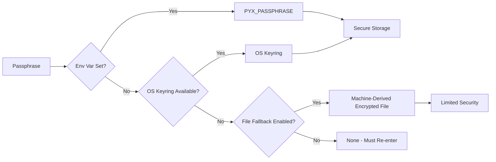

# Security

Encryption design, cryptographic parameters, and security best practices for pyx.

## Encryption Design

pyx uses **age encryption** with **scrypt** passphrase-based key derivation to protect API keys and credentials.

## Key Hierarchy

```mermaid
graph TD
    subgraph KeyHierarchy["Key Hierarchy"]
        P[Passphrase] -->|scrypt KDF| MK[Master Key]
        MK -->|age encryption| DB[Encrypted Database]
        MK -->|age encryption| KP[Key Providers]
    end
    
    subgraph Storage["Storage"]
        P -->|keyring/env| Storage
        MK -->|0600| MKFile[master.key]
        DB -->|0600| DBFile[database.json]
    end
```

## Cryptographic Parameters

### Scrypt Parameters (Passphrase to Master Key)

| Parameter           | Default        | Environment Variable     | Range      |
| ------------------- | -------------- | ------------------------ | ---------- |
| Work Factor (N)     | 2^18 (262,144) | `PYX_SCRYPT_WORK_FACTOR` | 14-30      |
| Salt Length         | 16 bytes       | `PYX_SCRYPT_SALT_LEN`    | 8-32 bytes |
| Block Size (r)      | 8              | Fixed                    | -          |
| Parallelization (p) | 1              | Fixed                    | -          |
| Output Key Length   | 32 bytes       | Fixed                    | -          |

### Tuning for Performance vs Security

**Higher Security (slower):**

```bash
export PYX_SCRYPT_WORK_FACTOR=20  # 2^20 iterations (~4x slower)
export PYX_SCRYPT_SALT_LEN=32    # Maximum salt length
```

**Faster Performance (lower security):**

```bash
export PYX_SCRYPT_WORK_FACTOR=16  # 2^16 iterations (~8x faster)
```

## Security Properties

### Protected Data

| Data              | Protection                                            |
| ----------------- | ----------------------------------------------------- |
| Master key        | Encrypted with passphrase via scrypt+age              |
| Provider API keys | Encrypted with master key via age                     |
| Passphrase        | OS keyring (primary); file fallback (opt-in, limited) |

### Threat Model

**Protected against:**

- Unauthorized file access (0600 permissions)
- Casual inspection (encrypted data)
- Offline brute-force (scrypt work factor)

**Not protected against:**

- Memory scraping while running
- Keyloggers
- Malware with user-level access
- Weak passphrases
- Physical access (file fallback uses non-secret machine identifiers)

## Passphrase Storage



### Precedence

1. **`PYX_PASSPHRASE`** - Environment variable (highest priority, for automation)
2. **OS Keyring** - SecretService (Linux), Keychain (macOS), Credential Manager (Windows)
3. **File Fallback** - Only when `PYX_ALLOW_FILE_FALLBACK=1` is set

### File Fallback Security

The file fallback (`~/.local/share/pyx/.passphrase`) is **disabled by default** because it uses machine-derived identifiers (not secret material) for encryption. This provides limited protection:

- Binds the file to a specific machine/user combination
- Does **not** protect against an attacker with filesystem access + knowledge of machine identifiers
- Only suitable when OS keyring is completely unreliable on your platform

Enable only if your system's keyring persistently fails to store credentials.

## File Permissions

| File             | Permission   | Owner           | Notes                    |
| ---------------- | ------------ | --------------- | ------------------------ |
| `master.key`     | 0600         | Read/write only | Encrypted master key     |
| `database.json`  | 0600         | Read/write only | Encrypted provider keys  |
| `.passphrase`    | 0600         | Read/write only | Only if fallback enabled |

## Best Practices

### Strong Passphrase

Use a **strong, unique passphrase**:

- Minimum 12 characters (20+ recommended)
- Mix of uppercase, lowercase, numbers, symbols
- Avoid common words or patterns
- Consider using a password manager

### Passphrase Storage

- **Default**: OS keyring provides secure, persistent storage
- **Automation**: Set `PYX_PASSPHRASE` in environment for scripted use
- **Fallback**: Only enable file fallback (`PYX_ALLOW_FILE_FALLBACK=1`) if keyring fails on your platform

## Incident Response

### If You Suspect Compromise

1. **Revoke** all API keys in provider dashboards
2. **Reset pyx**: `pyx reset`
3. **Generate new API keys** and re-run `pyx setup`
4. **Change passphrase** to a new, unique value

### If You Forget Your Passphrase

```bash
pyx reset  # Deletes all encrypted data
pyx setup  # Start fresh
```

## References

- [age encryption](https://age-encryption.org/)
- [scrypt paper (Colin Percival, 2009)](https://www.tarsnap.com/scrypt/scrypt.pdf)
- [NIST Password Guidelines (SP 800-63B)](https://pages.nist.gov/800-63-3/sp800-63b.html)
