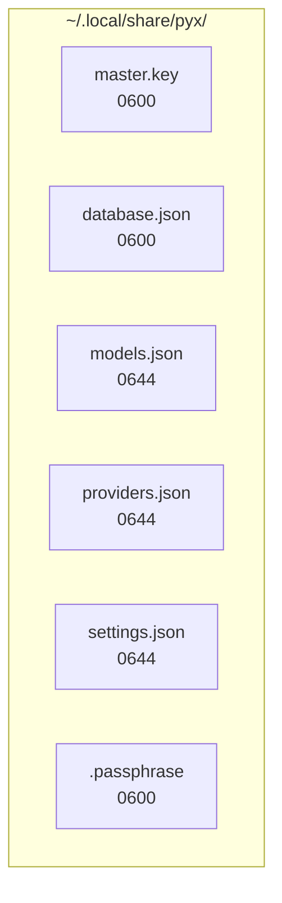

# Storage

Data files, formats, and directory structure for pyx.

## Data Directory

All pyx data is stored in:

```text
~/.local/share/pyx/
```

## File Structure



## File Descriptions

### master.key

Encrypted master key file.

| Property    | Value                |
| ----------- | -------------------- |
| Format      | age-encrypted binary |
| Permissions | 0600                 |
| Created     | During `pyx setup`   |

### database.json

Encrypted provider API keys.

| Property    | Value                             |
| ----------- | --------------------------------- |
| Format      | age-encrypted JSON                |
| Permissions | 0600                              |
| Contents    | Provider name → encrypted API key |

**Structure (before encryption):**

```json
{
  "providers": [
    {
      "name": "openai",
      "api_key": "sk-...",
      "env_var": "OPENAI_API_KEY"
    }
  ]
}
```

### models.json

Cached list of supported AI models.

| Property    | Value                 |
| ----------- | --------------------- |
| Format      | JSON                  |
| Permissions | 0644                  |
| Source      | Remote API or bundled |

### providers.json

Custom provider-to-environment-variable mappings.

| Property    | Value                               |
| ----------- | ----------------------------------- |
| Format      | JSON                                |
| Permissions | 0644                                |
| Location    | `~/.local/share/pyx/providers.json` |

**Example:**

```json
{
  "openai": "CUSTOM_OPENAI_KEY"
}
```

### settings.json

User preferences and configuration.

| Property    | Value   |
| ----------- | ------- |
| Format      | JSON    |
| Permissions | 0644    |

### .passphrase

Encrypted passphrase (fallback storage).

| Property    | Value                  |
| ----------- | ---------------------- |
| Format      | Machine-encrypted      |
| Permissions | 0600                   |
| Used when   | OS keyring unavailable |

## Directory Permissions

```bash
# Secure directory
chmod 700 ~/.local/share/pyx

# Secure files
chmod 600 ~/.local/share/pyx/master.key
chmod 600 ~/.local/share/pyx/database.json
chmod 600 ~/.local/share/pyx/.passphrase
```

## Backup

To backup your configuration:

```bash
# Backup data directory
tar -czf pyx-backup.tar.gz ~/.local/share/pyx/

# Restore
tar -xzf pyx-backup.tar.gz -C ~/
```

**Note:** Backups contain encrypted data. Without the passphrase, backups cannot be decrypted.
