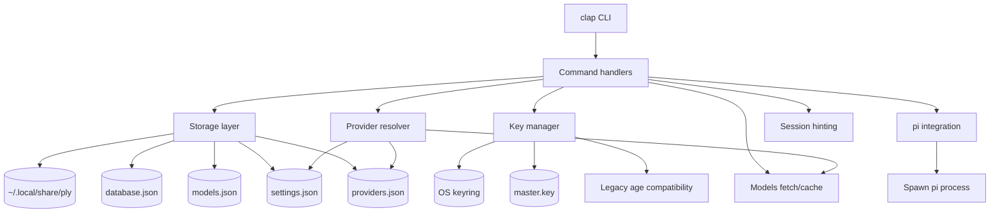

# Rust Rewrite Guide

Guide for rewriting `ply` from Go to Rust while preserving user-facing behavior, on-disk compatibility, and security properties.

## Purpose

This guide is based on the current codebase, not just the prose docs.

That distinction matters because there are a few mismatches between docs and implementation:

- The docs describe AES-256-GCM, but the current code uses `filippo.io/age` with scrypt-style passphrase encryption in `internal/crypto/crypto.go`.
- Some docs mention `config list` and `config edit`, while the current CLI code exposes commands such as `list`, `delete`, `models update`, `setup`, `reset`, and `pi install`.

For the Rust rewrite, the source of truth should be:

1. Current executable behavior
2. Existing tests
3. Existing on-disk data formats
4. Security-sensitive runtime behavior

## Rewrite Goals

Prioritize these goals in order:

1. Behavioral parity
2. Data compatibility
3. Security parity or improvement
4. Internal cleanup

This means the Rust rewrite should aim to:

- preserve the current CLI UX and argument semantics
- keep reading existing data in `~/.local/share/ply/`
- preserve decryption compatibility for existing stored credentials
- preserve keyring behavior and environment variable mapping behavior
- improve internals without breaking user workflows

## Current Codebase Inventory

## CLI Surface

Current commands implemented in `internal/cmd/`:

- `ply`
- `ply setup`
- `ply list`
- `ply delete [provider]`
- `ply models`
- `ply models update`
- `ply pi install`
- `ply reset`
- `ply completion [bash|zsh|fish|powershell]`
- `ply version`

Root command behavior from `internal/cmd/root.go`:

- `ply` runs `pi` with all configured providers
- `ply <provider>` runs `pi` with one provider
- `ply -- ...` passes arguments through to `pi`
- `ply -s, --session <uuid>` appends `--session <uuid>` to the `pi` invocation

## Data and Files

Current paths and files:

- Data dir: `XDG_DATA_HOME/ply` or `~/.local/share/ply`
- Encrypted provider DB: `database.json`
- DB backup: `database.json.bak`
- Models cache: `models.json`
- Settings: `settings.json`
- Encrypted master key file: `master.key`

## Security Model in Actual Code

Despite the architecture docs, the current code does not use AES-GCM. It currently does the following:

1. Generates a random 32-byte master key
2. Encrypts the master key into `master.key` using `age` with a passphrase
3. Gets the passphrase from the OS keyring, `PLY_PASSPHRASE`, or legacy fallback logic
4. Encrypts provider API keys in `database.json` using `age` again, with the raw master key bytes used as the passphrase input

Relevant files:

- `internal/crypto/crypto.go`
- `internal/keys/keys.go`
- `internal/database/database.go`

## Supporting Behavior

Additional behavior that must be preserved or consciously migrated:

- Provider names are derived from cached or fetched model metadata
- Provider-to-environment-variable mapping uses a mix of hardcoded rules and derivation heuristics
- `qwen` and `deepseek` are conditionally added when matching `~/.pi/agent/extensions/...` directories exist
- `ply` auto-installs `pi` if not already installed
- Completion scripts are installed into shell-specific locations
- Session hints are derived from `~/.pi/agent/sessions/...`

## Extension-Backed Providers and Models

This is one of the biggest areas to improve in the Rust rewrite.

Today, extension-backed providers such as `qwen` and `deepseek` are treated as special cases in `internal/providers/providers.go` via hardcoded filesystem checks. That is tightly coupled to specific extension names and does not scale.

pi's extension system already has a better model:

- extensions are auto-discovered from `~/.pi/agent/extensions/`, `.pi/extensions/`, and configured extension/package paths
- extensions can register providers dynamically with `pi.registerProvider(...)`
- pi already resolves the effective model list internally, including extension-provided models

Examples in the pi extension docs and examples:

- `custom-provider-qwen-cli/`
- `custom-provider-anthropic/`
- `custom-provider-gitlab-duo/`

Each of those extensions declares providers in code through `pi.registerProvider(...)`. That means `ply` should stop trying to infer extension-backed providers from filesystem heuristics.

### Rewrite goal

The Rust rewrite should remove provider-specific checks like `hasQwenExtension()` and `hasDeepSeekExtension()` entirely.

Instead:

- pi remains the source of truth for which providers and models exist
- `ply` only needs to know how to map an extension-registered provider name to the environment variable that should be exported when launching pi

### Important design constraint

Because pi extensions are TypeScript modules and provider registration happens programmatically, `ply` should not try to parse arbitrary extension source files or infer providers from directory names.

That would be brittle and unsafe.

### Recommended architecture

Until pi exposes a stable machine-readable provider registry, use a minimal `ply` provider-env config for extension-backed providers.

That config should contain only:

- provider name as registered by the extension in pi
- environment variable name to export for that provider

Models should not be stored in this config. pi already owns model resolution.

### Minimal config format

Recommended file: `~/.local/share/ply/providers.json`

```json
{
  "schemaVersion": 1,
  "providers": [
    {
      "name": "qwen-cli",
      "envVar": "QWEN_CLI_API_KEY"
    },
    {
      "name": "deepseek",
      "envVar": "DEEPSEEK_API_KEY"
    }
  ]
}
```

### Detailed schema

Top-level fields:

- `schemaVersion`: required integer, must be `1`
- `providers`: required array, may be empty

Provider entry fields:

- `name`: required string
- `envVar`: required string

No model definitions should be stored in this file. pi remains the source of truth for model discovery and provider model membership.

### Validation rules

#### `schemaVersion`

- required
- must equal `1`

#### `providers`

- required
- must be an array
- may be empty

#### `name`

- required
- must be non-empty
- must be unique within the file
- should follow the same provider-name validation rules used by `ply`
- should match `^[a-zA-Z0-9_-]{1,50}$`

#### `envVar`

- required
- must be non-empty
- must be a valid environment variable identifier
- should match `^[A-Z_][A-Z0-9_]*$`
- must not contain whitespace, `=`, or null bytes

### Semantic rules

- `name` is the provider name as registered by pi or by a pi extension through `pi.registerProvider(...)`
- `envVar` is the environment variable `ply` exports when launching pi for that provider
- unknown providers should be allowed in `providers.json`; the provider may come from an installed extension not otherwise visible to `ply`
- multiple providers may map to the same env var, but runtime conflict detection must preserve existing behavior: same secret is allowed, different secrets for the same env var is an error

### Registry merge strategy

Create a unified provider registry with deterministic precedence:

1. `providers.json`
2. legacy `settings.json.customProviderEnvVars`
3. remote pi-mono provider/model catalog
4. built-in fallback mappings
5. heuristic env-var derivation as a last resort

This keeps `ply` focused on credential storage and env-var mapping, while pi remains responsible for model discovery.

When multiple sources define the same provider name, the highest-precedence source wins.

### Migration guidance

For compatibility, the Rust rewrite should begin with runtime merging rather than forced migration.

Initial policy:

- load `providers.json` if present
- load `settings.json.customProviderEnvVars` if present
- merge both at runtime using the precedence above
- do not automatically rewrite or delete legacy settings on first run

This gives existing users a safe upgrade path while establishing `providers.json` as the preferred location for extension-backed provider env-var mappings.

Target end state:

- no hardcoded `qwen` or `deepseek` special cases
- extension-backed providers are declared by name in a small `providers.json` file
- pi remains the source of truth for models
- `settings.json` custom env-var mappings remain supported as legacy input during the transition
- if pi later exposes a stable provider registry, `providers.json` can remain as an override layer or compatibility fallback

### Deferred migration plan

After the Rust rewrite is stable, migration can become explicit rather than automatic.

Recommended phased approach:

1. support runtime merge only
2. document `providers.json` as the preferred location
3. optionally add a migration command, such as `ply provider-env migrate`
4. only later consider deprecation warnings for `settings.json.customProviderEnvVars`

The rewrite should avoid destructive or silent migration of user config.

### Backlog: extension mapping helper

This should stay out of V1 scope, but it belongs in the backlog:

- `ply provider-env generate --scan-extensions`

The command could inspect installed pi extensions, suggest likely provider names and environment variables, and reduce the manual setup burden around `providers.json`.

## Recommended Rewrite Strategy

Choose one of these approaches explicitly before implementation.

### Option A: Strict Compatibility

Use this if the Rust binary should be a drop-in replacement.

Requirements:

- Same CLI syntax and command behavior
- Same file paths and file formats
- Same keyring service/user semantics
- Same encryption and decryption behavior
- Same provider/env-var resolution behavior

Pros:

- Safest migration path for users
- No forced data conversion
- Simplest release story

Cons:

- Some existing design quirks remain
- Crypto compatibility may be awkward in Rust

### Option B: Compatibility with One-Time Migration

Use this if long-term maintainability matters more than byte-for-byte continuity.

Requirements:

- Rust binary can read old Go-generated state
- On first successful run, it migrates to a new Rust-native format
- New writes use only the new format

Pros:

- Cleaner long-term design
- Easier to improve crypto/storage abstractions

Cons:

- More complex implementation
- Requires careful migration testing
- More user support risk

### Recommendation

Start with Option A.

Only introduce migration after compatibility is proven and test fixtures are in place.

## Architecture Decision Records

Record high-impact rewrite decisions as ADRs under `docs/adr/` using `docs/adr/TEMPLATE.md`.

At minimum, capture:

- the outcome of the crypto compatibility spike
- the prompt library choice
- the sync vs async execution decision

That keeps risky rewrite choices documented with context, alternatives, and consequences rather than leaving them implicit in code or issue threads.

## Recommended Rust Architecture

Suggested layout:

```text
src/
  main.rs
  lib.rs
  cli.rs
  error.rs
  commands/
    mod.rs
    root.rs
    setup.rs
    list.rs
    delete.rs
    models.rs
    pi.rs
    reset.rs
    completion.rs
    version.rs
  crypto/
    mod.rs
    legacy_age.rs
  storage/
    mod.rs
    paths.rs
    database.rs
    settings.rs
    providers_env.rs
    models_cache.rs
    atomic_write.rs
  keys/
    mod.rs
    keyring.rs
    manager.rs
  models/
    mod.rs
    fetch.rs
    parse.rs
  providers/
    mod.rs
    mapping.rs
    validation.rs
  prompt/
    mod.rs
  session/
    mod.rs
  pi/
    mod.rs
  validation/
    mod.rs

tests/
  cli/
  compatibility/
  fixtures/
```

### Design Notes

- `main.rs` should stay thin and only handle top-level exit/reporting
- Command logic should live in library modules for testability
- Legacy crypto compatibility should be isolated in one module
- Storage, key management, provider rules, and process execution should remain independent

## Crate Recommendations

| Concern               | Recommended crate(s)         | Notes                                            |
| --------------------- | ---------------------------- | ------------------------------------------------ |
| CLI parsing           | `clap`                       | Strong replacement for Cobra-style CLI structure |
| Shell completions     | `clap_complete`              | Covers bash, zsh, fish, PowerShell               |
| Serialization         | `serde`, `serde_json`        | Required for file compatibility                  |
| Errors                | `thiserror`                  | Clean typed domain errors                        |
| Secret handling       | `secrecy`, `zeroize`         | Prefer explicit zeroization and secret wrappers  |
| Keyring               | `keyring`                    | OS keychain integration equivalent               |
| Regex/session parsing | `regex`                      | Match current session filename logic             |
| Time                  | `time` or `chrono`           | `time` is lightweight and works well with serde  |
| PATH lookup           | `which`                      | For `pi`, `npm`, `pnpm`, `yarn`, `bun` detection |
| Interactive prompts   | `dialoguer`                  | Replace `tap`                                    |
| HTTP                  | `ureq` or blocking `reqwest` | Sync is likely enough for this CLI               |
| Testing CLI           | `assert_cmd`, `predicates`   | Integration testing                              |
| Temp dirs/files       | `tempfile`                   | For storage and migration tests                  |
| Snapshots             | `insta`                      | Helpful for command output                       |
| HTTP mocking          | `mockito` or `wiremock`      | For models fetch tests                           |

### Prompt Library Choice

Choose `dialoguer` over `inquire` for the initial rewrite plan. It is a closer API match for `ply`'s current prompt flow, appears better aligned with the simple interactive needs of this CLI, and keeps the dependency surface smaller. Revisit that choice only if the Rust rewrite needs richer prompt widgets that `dialoguer` cannot support cleanly.

### Async vs Sync

Prefer synchronous Rust unless a clear async need appears.

This CLI mainly performs:

- file I/O
- keyring access
- HTTP fetches
- child process spawning

A synchronous design will likely be simpler, easier to test, and faster to start.

## Go-to-Rust Module Mapping

| Go path                     | Rust target                   |
| --------------------------- | ----------------------------- |
| `cmd/ply/main.go`           | `src/main.rs`                 |
| `internal/cmd/*`            | `src/commands/*`              |
| `internal/crypto/*`         | `src/crypto/*`                |
| `internal/database/*`       | `src/storage/database.rs`     |
| `internal/fs/*`             | `src/storage/paths.rs`        |
| `internal/keys/*`           | `src/keys/*`                  |
| `internal/models/cache.go`  | `src/storage/models_cache.rs` |
| `internal/models/fetch.go`  | `src/models/fetch.rs`         |
| `internal/models/parse.go`  | `src/models/parse.rs`         |
| `internal/models/models.go` | `src/models/mod.rs`           |
| `internal/pi/*`             | `src/pi/*`                    |
| `internal/prompt/*`         | `src/prompt/*`                |
| `internal/providers/*`      | `src/providers/*`             |
| `internal/session/*`        | `src/session/*`               |
| `internal/settings/*`       | `src/storage/settings.rs`     |
| `internal/validation/*`     | `src/validation/*`            |

## Compatibility Risks to Resolve Early

These risks should be validated before major implementation begins.

### 1. Crypto Compatibility

This is the highest-risk part of the rewrite.

The Go code currently:

- generates raw random bytes for the master key
- converts those raw bytes to a Go `string`
- passes that string into `age`'s scrypt recipient/identity APIs

In Go, strings can hold arbitrary bytes. In Rust, `String` must be valid UTF-8.

That creates a major compatibility question: can the Rust `age` ecosystem reproduce the exact current encryption/decryption behavior for existing data?

#### Required spike

In Week 1, before building the rest of the Rust app, verify whether Rust can:

- decrypt a real Go-produced `master.key`
- decrypt a real Go-produced provider cipher from `database.json`
- re-encrypt values in a way that remains compatible if dual-read or round-trip support is required

#### If direct compatibility is not possible

Possible fallback options:

1. Keep a tiny Go compatibility helper for migration only
2. Reimplement the needed byte-level behavior using lower-level primitives if available
3. Support one-time migration using the Go binary before switching users fully to Rust

### 2. Keyring Compatibility

Current semantics in Go:

- service: `ply`
- user: `master-key`
- stored secret: password used to encrypt/decrypt `master.key`
- env fallback: `PLY_PASSPHRASE`
- legacy fallback passphrase: `default`
- failed load rate limiting is enforced in the manager

Rust keyring behavior should be tested on Linux, macOS, and Windows early.

### 3. File Format Compatibility

Exact compatibility matters for:

#### `database.json`

```json
{
  "provider": "openai",
  "cipher": "...",
  "created_at": "2026-03-09T12:34:56Z",
  "updated_at": "2026-03-09T12:40:00Z"
}
```

#### `models.json`

```json
{
  "version": "vX.Y.Z",
  "updated_at": "2026-03-09T12:34:56Z",
  "models": {
    "openai": ["openai/gpt-5"]
  }
}
```

#### `settings.json`

Must preserve:

- GitHub source overrides
- custom provider environment variable mappings

### 4. CLI Parsing Parity

Preserve root parsing behavior from `internal/cmd/root.go`:

- first non-flag arg may be a provider
- `--` splits provider selection from `pi` pass-through args
- `--session/-s` is forwarded to `pi`
- child process exit codes are preserved

### 5. Provider and Env-Var Rules

Preserve behavior from `internal/providers/providers.go` where it affects compatibility, but improve the architecture in the rewrite:

- keep hardcoded mappings only as fallback compatibility behavior
- keep derived fallback env-var naming as a last resort
- preserve provider name validation rules
- replace embedded extension-driven availability checks for `qwen` and `deepseek` with a minimal provider-env config
- preserve conflict handling where multiple providers map to the same environment variable
- treat extension-registered provider names as first-class registry entries without duplicating model definitions in `ply`

## Phased Rewrite Plan

### Week 1: Crypto compatibility spike

Before broader Rust implementation work, write a minimal Rust program that attempts to decrypt a real Go-generated `master.key`.

This is a decision gate, not a research task to let drift for weeks.

If the spike succeeds, continue with the strict-compatibility plan. If it fails, decide immediately between:

1. a tiny Go compatibility shim
2. lower-level Rust primitives to reproduce the Go behavior exactly
3. Option B one-time migration

Document the outcome in an ADR before proceeding.

### Fixture generation checklist

Complete this checklist before Phase 0 fixture work is considered ready:

- valid `database.json`
- duplicate provider entries
- corrupted database file
- valid encrypted `master.key`
- legacy master key behavior
- `settings.json` overrides
- all provider mapping patterns, including hardcoded, derived, custom, and extension-backed cases
- root arg parsing edge cases
- session parsing edge cases
- model cache fresh and stale cases

## Phase 0: Freeze Current Behavior

Before writing Rust implementation logic, capture the current Go behavior with fixtures and tests.

### Produce fixtures for

- valid `database.json`
- duplicate provider entries
- corrupted database file
- valid encrypted `master.key`
- legacy master key behavior
- `settings.json` overrides
- provider/env-var mapping edge cases
- extension-backed provider name to env-var config cases
- model cache fresh and stale cases
- root arg parsing edge cases
- session file parsing cases

### Exit criteria

- Fixture set exists and is checked into the repo
- Compatibility expectations are explicit
- Current behavior is documented by tests rather than memory

## Phase 1: Core Data and Paths

Implement in Rust:

- data directory resolution
- settings loading and saving
- models cache loading and saving
- database loading and saving
- backup and atomic write behavior
- secure file permissions where supported

### Exit criteria

- Rust can read and write JSON files compatible with current semantics
- Atomic write and backup behavior is covered by tests

## Phase 2: Providers and Validation

Implement:

- provider validation
- env-var mapping
- env-var derivation fallback rules
- loading and validating `providers.json`
- unified provider registry merging provider-env config, remote catalog, and local overrides
- shell arg validation

### Exit criteria

- mapping parity tests pass
- invalid input cases match current behavior

## Phase 3: Crypto and Key Management

Implement:

- key manager
- keyring integration
- `master.key` load/save behavior
- password fallback logic
- legacy fallback behavior
- zeroization for secret values

### Exit criteria

- Rust can decrypt real Go-generated fixtures
- password and keyring fallbacks behave as expected
- secret handling is tested where practical

## Phase 4: Read-Only Commands

Implement lower-risk commands first:

- `version`
- `models`
- `list`
- completion generation
- `pi` detection/version helpers

### Exit criteria

- commands are testable without mutating state
- output format is stable enough for snapshot testing

## Phase 5: Mutating Commands

Implement:

- `setup`
- `delete`
- `reset`

### Exit criteria

- newly written Rust state is internally consistent
- if strict compatibility is a goal, verify old Go code can still read the written files where applicable

## Phase 6: Root Execution Path

Implement the main execution flow:

- provider selection
- decryption of stored API keys
- env-var construction
- `pi` process spawning
- session hint generation
- child exit code propagation

### Exit criteria

- `ply`, `ply <provider>`, and `ply -- ...` all behave correctly
- session forwarding and pass-through arguments behave correctly

## Phase 7: Polish and Release Preparation

Implement and verify:

- completion installation paths
- package manager detection for `pi install`
- user-facing error formatting
- docs and migration notes
- packaging and release flow

### Exit criteria

- release artifacts are buildable
- install and upgrade path is documented
- user docs match actual command behavior

## Suggested Porting Order by Command

### Lowest-risk ports

- `version`
- `completion` generation
- `models`
- `list`
- session parsing helpers

### Medium-risk ports

- `delete`
- `pi install`
- providers/env-var mapping
- settings/model fetching

### Highest-risk ports

- `setup`
- root execution flow
- key management
- crypto compatibility layer
- reset and migration flows

## Rust Design Recommendations

### Error Handling

Use typed domain errors with `thiserror`.

Suggested pattern:

- library code returns `Result<T, PlyError>`
- top-level command runner converts errors into user-facing messages and exit codes

This is cleaner and more testable than spreading direct process exits throughout the implementation.

### Secret Handling

Use explicit secret wrappers and zeroization:

- `SecretString` or `SecretVec`
- `zeroize`

Pay close attention to:

- decrypted API key lifetimes
- temporary buffers
- environment variable construction
- password copies created by prompts or keyring APIs

### Process Execution

Use `std::process::Command` directly:

- avoid invoking a shell
- pass arguments as structured values
- preserve child exit code
- inject environment variables explicitly

### Atomic Writes

Preserve current behavior for sensitive files:

1. create backup when overwriting existing `database.json`
2. write to a temp file
3. rename atomically

This should be treated as a compatibility and reliability requirement.

## What to Preserve vs What to Improve

### Preserve

- CLI surface and argument semantics
- on-disk file paths and file formats
- keyring identifiers and fallbacks
- provider/env-var resolution behavior
- `pi` execution and pass-through semantics
- session hint behavior

### Improve

- remove global mutable command state where possible
- keep completion generation internal rather than self-spawning if convenient
- centralize error formatting
- separate pure logic from I/O
- replace embedded extension-provider logic with a small declarative `providers.json` mapping
- make provider mapping logic easier to test
- make compatibility behaviors explicit rather than incidental

## Architecture Overview



## Compatibility Test Plan

Create a dedicated compatibility suite under `tests/compatibility/`.

### 1. File compatibility tests

- parse real Go-generated `database.json`
- parse real Go-generated `models.json`
- parse real Go-generated `settings.json`
- verify serialization does not break expected shapes or timestamps

### 2. Crypto compatibility tests

- decrypt Go-generated `master.key`
- decrypt Go-generated provider cipher text
- load password from keyring or environment fallback
- verify failure modes for wrong password and legacy fallback

### 3. CLI behavior tests

- `ply`
- `ply openai`
- `ply -- --help`
- `ply -s <uuid>`
- `ply models --json`
- `ply completion bash`
- `ply delete <provider>`

### 4. Provider mapping tests

Use table-driven cases for:

- known mappings
- `providers.json` overrides for extension-backed providers
- derived mappings
- special cases like `google-vertex`, `minimax-cn`, `vercel-*`
- unknown but derivable provider names
- invalid provider names
- duplicate provider names or invalid env vars in `providers.json`

### 5. Models fetch/cache tests

- fetch latest release tag
- fetch models file
- stale cache fallback
- no-cache error path
- cached fallback when network fails

### 6. Session parsing tests

- valid session filename parsing
- invalid filename rejection
- most recent session selection
- path encoding/decoding behavior

## Definition of Done

The rewrite should not be considered complete until all of the following are true:

- Existing `database.json` can be read
- Existing `master.key` can be decrypted
- Keyring behavior matches current app behavior
- `ply`, `ply <provider>`, and `ply -- ...` work as expected
- `setup`, `list`, `delete`, `models`, `reset`, `pi install`, `completion`, and `version` all work
- Shell completion generation and installation work across supported shells
- Provider env-var collisions behave correctly
- Model cache TTL behavior matches current semantics
- Session hint parsing works against real `~/.pi/agent/sessions` data
- Compatibility-critical behavior is covered by tests
- User-facing docs are updated to match actual behavior

## Recommended First Milestone

Build a compatibility skeleton first.

### Milestone 1 scope

Create a Rust binary that can:

- parse the CLI
- load paths, settings, database, and models cache
- list configured providers
- print version
- fetch models
- resolve provider env-var mappings
- parse session files

Separately, perform a crypto spike proving whether Rust can decrypt Go-generated `master.key` and `database.json` entries.

### Why this first

The crypto compatibility question is the main technical risk. It should be resolved before investing heavily in the rest of the rewrite.

## Immediate Next Steps

1. Create compatibility fixtures from the Go implementation using the fixture generation checklist
2. In Week 1, spike Rust decryption of a real Go-generated `master.key`
3. Record the crypto decision in an ADR and decide strict compatibility vs one-time migration
4. Define and validate the minimal `providers.json` schema for extension-backed provider env-var mapping
5. Scaffold the Rust crate layout
6. Implement read-only paths, storage, provider registry, and `providers.json` loading first

## Summary

Best rewrite strategy for this codebase:

- freeze current behavior with fixtures and tests
- treat current code as the source of truth
- run a Week 1 crypto compatibility spike before large-scale porting
- document major rewrite decisions with ADRs
- choose `dialoguer` for prompts unless a stronger requirement appears
- replace embedded extension-specific provider logic with a minimal `providers.json` mapping for extension-backed providers
- keep pi as the source of truth for models
- keep `ply provider-env generate --scan-extensions` in the backlog rather than V1 scope
- build a unified provider registry that merges `providers.json`, remote, and local definitions
- port read-only functionality first
- port mutating flows second
- only change storage format after compatibility is proven and migration is designed
